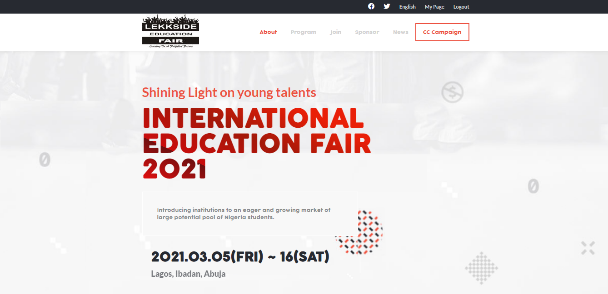

# International Education Fair

> This is an online page for the International Education Fair holding in Lagos from 5th to 6th of March 2021.



The page is designed to create awareness for the event. Interested participants can also purchase tickets on the site.

## Built With

- HTML
- CSS
- Javascript

## Live Demo

[Live Demo Link](https://chasscepts.github.io/capstone-project-html/)


## Getting Started

To get a local copy up and running follow these simple example steps.

### Clone the project from it's github repo.

```

    git clone https://github.com/chasscepts/capstone-project-html.git

```

### Run npm install to setup local linters (the packages to install are already setup in devDependencies of the package.json).

```

    npm install

```

## Authors

👤 **Obetta Francis**

- GitHub: [@chassecpts](https://github.com/chassepts)
- Twitter: [@ofChass](https://twitter.com/ofChass)
- LinkedIn: [LinkedIn](https://www.linkedin.com/in/francis-obetta-4033b71bb/)

## 🤝 Contributing

Contributions, issues, and feature requests are welcome!

Feel free to check the [issues page](https://github.com/chasscepts/capstone-project/issues).

## Show your support

Give a ⭐️ if you like this project!

## Acknowledgments

- This project was inspired by [Cindy Shin in Behance](https://www.behance.net/adagio07)
- The logo used is a trademark of [Lekkside Education Consult](https://lekside.com/)
- Pictures are copied from [Lekkside Education Consult](https://lekside.com/)
- Thanks to Microserve students whose pictures are used in the project.
- Lato typeface family is designed by designer Łukasz Dziedzic.
- COCOGOOSE is a trademark of Studio kmzero.
- I appreciate everyone whose work was used in this project.

## 📝 License

This project is [MIT](https://opensource.org/licenses/MIT) licensed.
